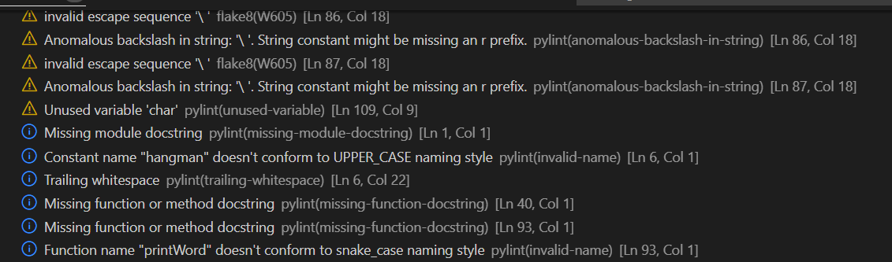
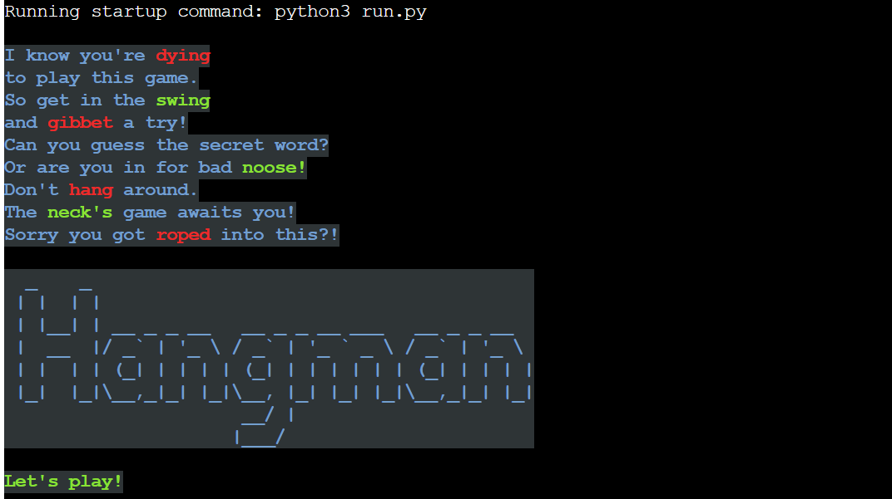

# **Hangman**

Hangman is an old-fashioned word guessing game. It is traditionally played with pencil and paper. This version is played on a Python terminal.

This is the live site: **[https://hangmancbherokuapp.com/] (https:https://caitriona71-hangman-x0fpps1qtth.ws-eu72.gitpod.io)**   

## **How to play Hangman**

**1.** The game appears and the user is invited to play and asked to guess a letter. 
**2.** A secret word is displayed with dashes - the number of dashes represents how many letters are in the word.  
**3.** On the display under the dashes for the secret word, there is a message listing all the letters the player has already guessed. 
**4.**  Every time the user guesses a letter, it is added to this list. 
**5.** If the user guesses a wrong letter, the gallows image is displayed and an attachment is added to the hanging man.  
**6.** If the user guesses a letter in the secret word, it will be displayed on the dash where it appears in the word. 
**7.** The hangman image is only displayed when the user chooses a wrong letter.  
**8.** The user has 6 attempts to guess the word.  
**9.** The game ends when the 6 attempts are used up or if the user guesses the correct word before all attempts have been used. 
**10.** A message is displayed informing the user that the game is over and inviting them to play again.

## **Features**

### ***Lighthouse*** - The quiz was tested for performance using Lighthouse.
 

*  At the top of the terminal an amusing colorful play on words introduces the game of hangman.  
]

* ASCII font has been used to display Hangman as a banner.  
  

* The game begins with an invitation to the user to play the game. Blank dashes display the secret word to be guessed.  
 

* Underneath the dashes a message is displayed to the user listing all the letters they have guessed.  

* If an incorrect letter is chosen the gallows image appears and an attachment is displayed for each incorrect guess.  

* If a correct letter is guessed it is displayed on the dash where it appears in the word.  

* When all attempts are used up the game is over and the user is asked if they would like to play again.  
  

## **Technologies Used**

* Python was the coding language used for the project.
* Gitpod was used to code, commit and push the project.
* Heroku was used to deploy the project.
* GitHub was used to store the project after pushing.  

## **Testing**

* As Pep8 is down, we were advised to go through the problems that appear in the terminal to validate our code.  There were problems appearing in red - mainly indentation errors or if a line was too long.  These were corrected as they came up.

* There were warnings also - yellow ones referred to the slash used on the hangman image.  It was suggested these might be missing an 'r' prefix.  I ignored these as I knew they weren't related to that. Others were referring to the Hangman ascii banner. Blue errors were pylint errors and having checked on slack, the advice was that these were not concerning.  
 

* Each stage of the game was tested.  If the user enters a letter for example, the letter appends to the right list. If the letter the user guesses is wrong, the hangman appears with another attachment.

* The colored text was problematic.  It works but screen color around where text color has been applied not resetting.  
  

## **Deployment**

* The game was deployed to Heroku.
* A new app was created.
* Under the settings tab the app was named and "Reveal Config Vars" was selected and given the key of `PORT`, and the value was set at `8000`.  
* "Add buildpack" was selected to add python and node js in that order.
* Under the Deploy tab, "Deployment Method" was selected then "GitHub" was clicked and "Connect to GitHub". 
* The relevant repository was selected by clicking "Connect".
* "Enable Automatic Deploys" was selected next so that Heroku would rebuild the app any time changes were pushed to GitHub.  

## **Credits**

* Youtube tutorial - Sean Halverson - [https://www.youtube.com/watch?v=pFvSb7cb_Us&t=71s]
* [TextKool.com](https://www.textkool.com) for ascii font at top of game.
* [ozzmaker.com/add-colour-to-text-in-python](https://ozzmaker.com) for adding color to the text.
* [inventwithpython.com/chapter8.html](https://inventwithpython.com) for hangman images.
* [online-python.com](https://online-python.com) IDE to check if code was working.  

## **Acknowledgements**

* Tutor support at Code Institute.
* My course Facilitator.
* My peers on the course.
   
